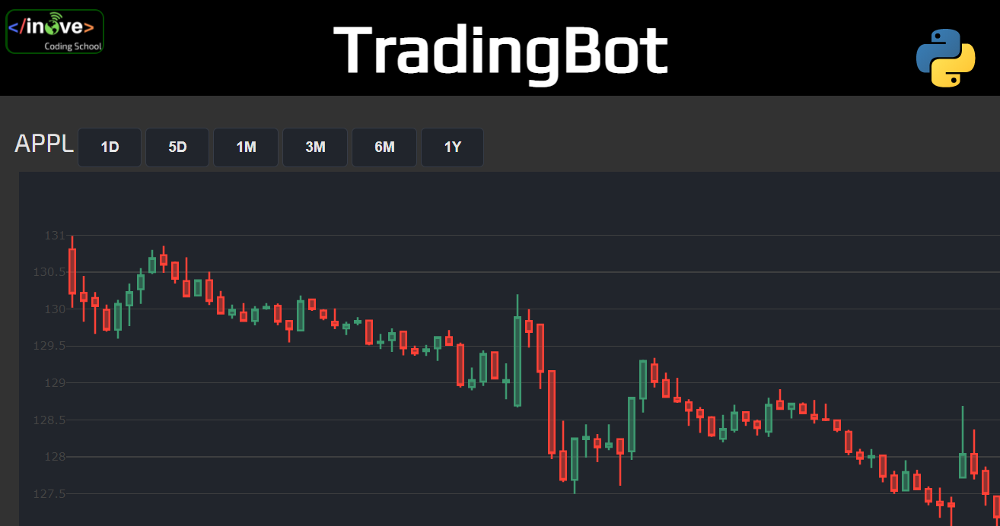

# :stethoscope:	Python TradingBot
### BOT de acciones

Este es un proyecto realizado por miembros de inove, junto con Ariel de InverArg.

# Comenzando 🚀
El objetivo de este proyecto es dar un ejemplo de aplicación de Python en la automatización de captura de datos como el valor de las accioens en la bolsa, y la toma de decisiónes, gráficos y alertas en tiempo real. Este proyecto se basa en recolectar por API los datos de determinadas acciones, almacenar esa información en una DB y luego graficar con Plotly los datos y generar alertas enviadas por telegram.

# Pre-requisitos 📋
Para poder ejecutar esta aplicación, será necesario tener instalada la versión 3.7 de Python o superior. También es necesario incluir varios módullos.
Recomendamos antes de descargar el repositorio, realizar los siguientes pasos:

```
pip3 install pip -U --upgrade
pip3 install numpy
pip3 install matplotlib
pip3 install plotly
pip3 install sqlalchemy
pip3 install requests
pip3 install -U Flask
pip3 install pandas
pip3 install finta
```

# Instalación y pruebas 🔧⚙️
Descargue el repositorio en su pc y abra el proyecto en su editor de código, luego ejecute el archivo ```run.py```. La aplicación crea un servidor local en la dirección http://127.0.0.1:5000/ en donde tendremos alojado el frontend de nuestra aplicación. Las direcciónes para acceder a la página de la aplicación es:

- http://127.0.0.1:5000          # Pagina principal, allí podremos acceder a los datos recolectados.

# Construido con 🛠️
- Visual Studio Code (https://code.visualstudio.com/)
- Python 3.7 (https://www.python.org/)
- Mathplotlib (https://matplotlib.org/)
- Flask (https://flask.palletsprojects.com/)
- Pandas (https://pandas.pydata.org/)
- NumPy (https://numpy.org/)

# Capturas :camera:
Pantalla principal:



# Autores ✒️
### Miembros de Inove (coding school)
:octocat: Hernán Contigiani 

:octocat: Hector Vergara

# Licencia 📄 :balance_scale:
Este proyecto está bajo la Licencia de Inove (coding school) para libre descarga y uso. Este proyecto tiene un propósito educativo y de muestra, por ello, no nos responsabilizaremos por su uso indebido. Así mismo, no existe garantía en su implementación debido a que se trata de una demostración de uso gratuito con propósitos educativos. 
### :copyright: Inove (coding school) 2021.